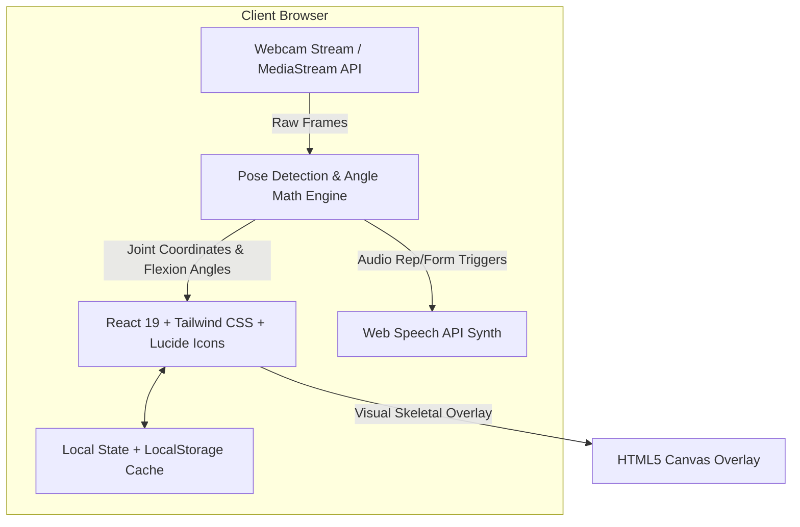

# Tech Stack & System Architecture

## Project: FitMitra
*AI-Powered Student Fitness & Campus Wellness Platform*

---

## 1. High-Level Architecture
FitMitra is built with a **high-performance, privacy-preserving, 100% client-side architecture**. This eliminates cloud hosting costs, delivers real-time sub-30ms computer vision inference on everyday student laptops/phones, and protects student privacy by keeping all video data strictly local.



---

## 2. Core Technologies

### 2.1 Frontend Framework & Tooling
- **React 19**: Component-driven reactive UI for responsive dashboards, timers, and interactive controls.
- **Vite**: Ultra-fast next-generation frontend build tool with instantaneous Hot Module Replacement (HMR).
- **Tailwind CSS v3**: Utility-first styling with custom dark-neon theme tokens (`neon-green: #22c55e`, `cyber-cyan: #06b6d4`, `electric-purple: #a855f7`, `dark-slate: #090d16`).

### 2.2 Computer Vision & AI Pose Analysis
- **Engine**: Real-time browser-based computer vision for 33 landmark human pose detection (compatible with MediaPipe Pose landmarks protocol).
- **Trigonometric Kinematics**:
  - **Knee Angle Calculation**: \(\theta = \arccos\left(\frac{\mathbf{u}\cdot\mathbf{v}}{\|\mathbf{u}\|\|\mathbf{v}\|}\right)\) using Hip, Knee, and Ankle 3D vectors to determine squat inflection points (\(< 90^\circ\) for full depth, \(> 160^\circ\) for standing extension).
  - **Elbow & Shoulder Flexion**: Tracks arm abduction for jumping jacks and push-up form.
  - **Cervical Spine & Head Inclination**: Compares ear-to-shoulder angle to detect forward head posture (slouching / text neck) during study sessions.
- **HTML5 Canvas 2D Context**: High-speed 60 FPS skeletal wireframe and angle feedback rendering directly layered on top of the webcam feed.

### 2.3 Audio & Voice Synthesis
- **Web Speech Synthesis API (`window.speechSynthesis`)**:
  - Provides natural, instantaneous voice alerts without external API keys or server round-trips.
  - Features dynamic coaching phrases: *"Great depth, keep it up!"*, *"Rep 5 completed!"*, *"Straighten your spine!"*.
- **Web Audio API**: Synthetic audio chime generation for countdowns and workout interval changes.

### 2.4 Data Persistence & Client Storage
- **LocalStorage & IndexedDB**:
  - Stores student profile, workout history, daily streak counters, FitCoins balance, logged mess meals, and campus squad points.
  - Export/Import JSON feature allows students to back up or transfer their progress.

---

## 3. Directory Structure
```
fitmitra/
├── index.html
├── package.json
├── vite.config.js
├── tailwind.config.js
├── postcss.config.js
├── prd.md
├── techstack.md
├── phases.md
├── memory.md
├── README.md
├── public/
│   └── favicon.ico
└── src/
    ├── main.jsx
    ├── App.jsx
    ├── index.css
    ├── context/
    │   └── FitnessContext.jsx       # Global state for FitCoins, streaks, user profile
    ├── data/
    │   ├── messMenu.js              # Student mess food database & macros
    │   ├── exercises.js             # Dorm-friendly exercise catalog
    │   └── campusLeaderboard.js     # Campus wings & hostel leaderboard data
    ├── components/
    │   ├── Navbar.jsx               # Header with coins, streak flame, level badge
    │   ├── AIPoseCoach/             # Real-time computer vision rep counter & form coach
    │   │   ├── PoseCoach.jsx
    │   │   ├── CameraView.jsx
    │   │   └── AngleMath.js
    │   ├── PostureSentinel/         # Study desk slouch & neck crane detector
    │   │   └── PostureSentinel.jsx
    │   ├── DormWorkouts/            # Micro-workouts, HIIT, and Pomodoro breaks
    │   │   ├── WorkoutHub.jsx
    │   │   └── ActiveWorkoutModal.jsx
    │   ├── MessNutrition/           # Mess meal logger & budget protein calculator
    │   │   ├── NutritionTracker.jsx
    │   │   └── BudgetProteinHacks.jsx
    │   ├── Gamification/            # Quests, FitCoin shop, hostel wing standings
    │   │   └── LeaderboardAndQuests.jsx
    │   └── Wellness/                # 4-7-8 Box breathing, hydration, 20-20-20 rule
    │       └── ExamStressReset.jsx
    └── utils/
        ├── voiceCoach.js            # Web Speech API wrapper
        └── soundEffects.js          # Web Audio synth beeps
```

---

## 4. Hardware & Browser Requirements
- **Supported Browsers**: Chrome 90+, Edge 90+, Firefox 90+, Safari 15+ (Desktop & Mobile).
- **Webcam**: Standard integrated 720p or 1080p laptop/phone webcam.
- **Offline Readiness**: PWA-ready architecture, fully capable of operating without an active internet connection once loaded.
